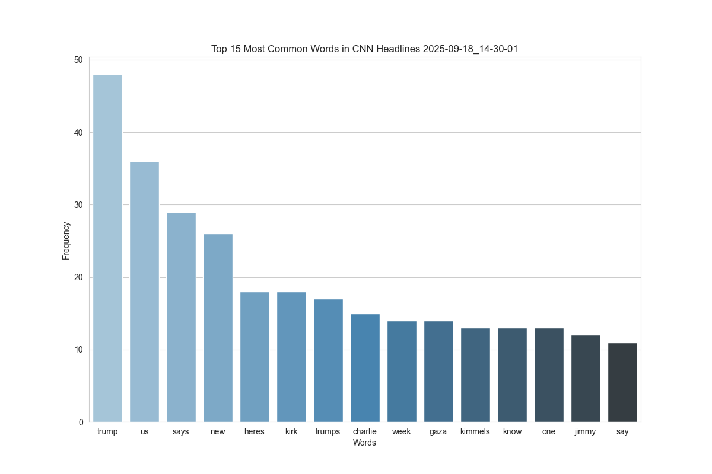
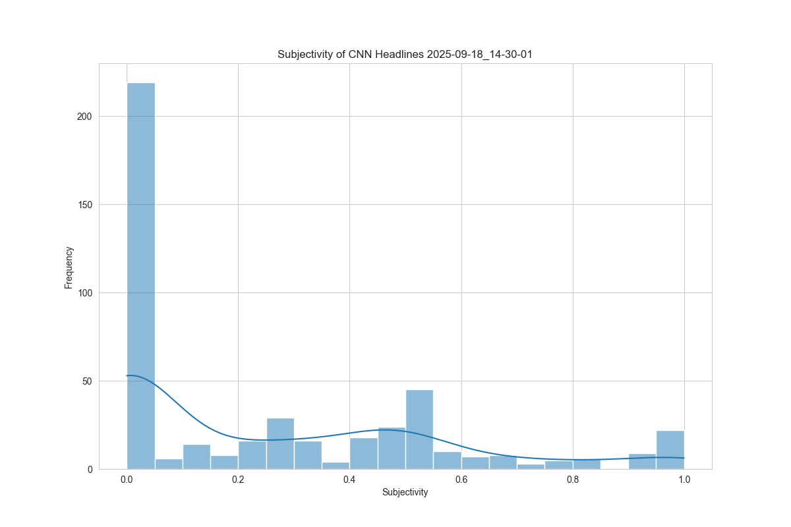

# CNN Headline Scraper & Sentiment Analyzer (Phase 1) 📰

Analyze the mood of the news! This Python project scrapes headlines from CNN, uncovers the most common keywords, and visualizes sentiment trends related to the most common keywords at that time.

---

## 🔹 Key Features

- Scrapes live headlines from CNN sections.
- Identifies most frequent keywords.
- Measures sentiment (polarity & subjectivity) of each headline using TextBlob.
- Generates charts for:
  - Word frequency
  - Polarity & subjectivity distributions
  - Sentiment of top keywords
- Exports results as **CSV**, **Excel**, and **PNG plots** in organized, timestamped folders.

---

## 🔹 How It Works

1. Fetch headlines using **BeautifulSoup**.
2. Clean text and extract keywords.
3. Analyze sentiment with **TextBlob**.
4. Visualize results using **Seaborn** and **Matplotlib**.
5. Save data and plots in a neatly organized and timestamped folder.

---

## 🔹 Example Output Images

**Top Keywords by Frequency**  


**Sentiment of Headlines**  


_(Screenshots are illustrative; actual outputs vary based on current headlines.)_

---

## 🔹 Usage

Clone this repository and install the required dependencies:

```bash
git clone https://github.com/hinsoned/Headline-Scraper.git
cd Headline-Scraper
pip install -r requirements.txt

```

Then run the code from the terminal using one of these commands (your choice of command will be dependent on your version of python):

```bash
python3 app.py
pthon app.py
```

---

## 🔹 Expected Output

You should see:

- A timestamped folder called cnn*reeports*\<timestamp\>
- Inside that folder you should find:
  - avg_polarity\<timestamp\>.png
  - avg_subjectivity\<timestamp\>.png
  - cnn*headlines*\<timestamp\>.csv
  - cnn*report*\<timestamp\>.xlsx
  - sentiment\<timestamp\>.png
  - subjectivity\<timestamp\>.png
  - word_counts\<timestamp\>.png

## 🔹 Notes

I anticipate adding more phases to this project in the future including scraping other news sites, creating a database of scrapings from each day, hosting this information, and creating an API for this database.
